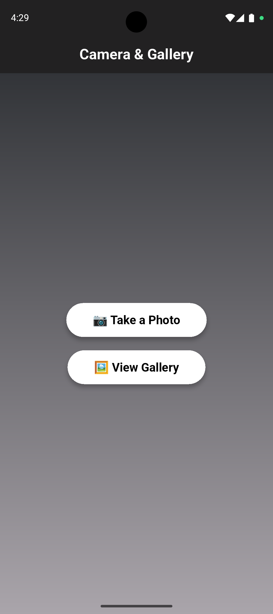
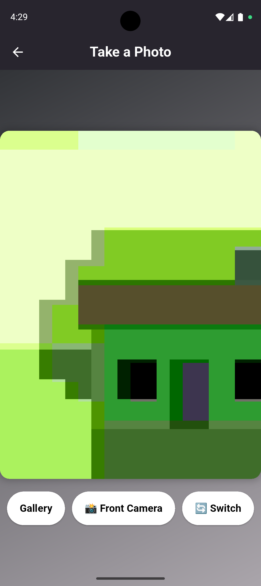
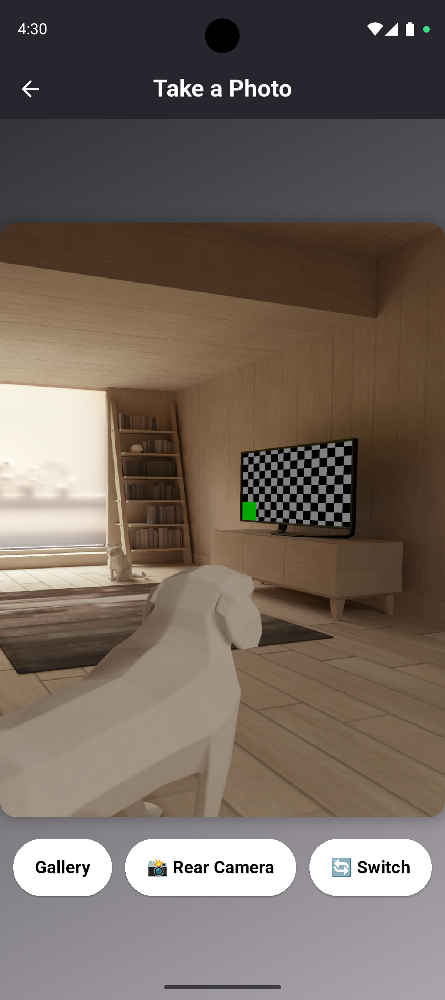
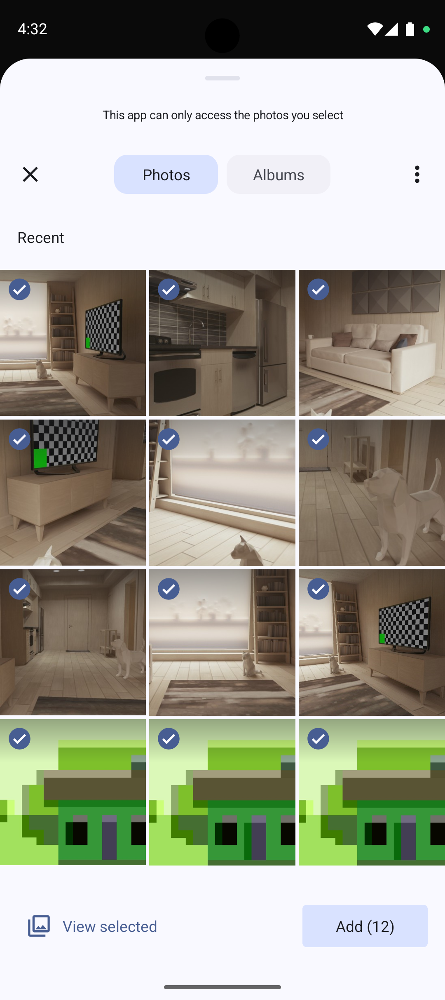
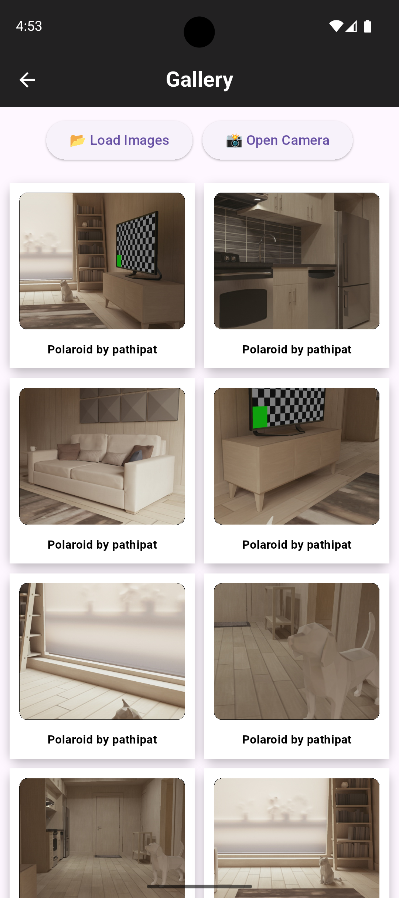
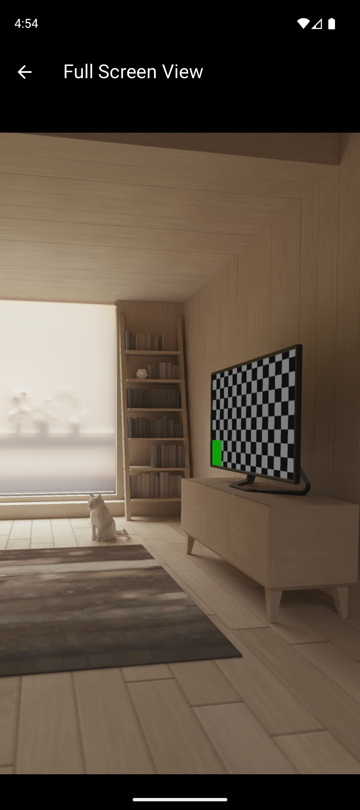

# Flutter Camera Application

This **Flutter Camera Application** is a mobile app built with **Flutter** that allows users to capture photos, browse their gallery, and view images in full-screen mode. The app provides a smooth and intuitive user experience, enabling seamless switching between the front and rear cameras.  

### 🔹 Key Features  
- 📸 Capture photos using the device camera  
- 🔄 Switch between front and rear cameras  
- 💾 Save images automatically to the gallery  
- 🖼️ Browse saved images in a gallery grid  
- 🔍 View images in full-screen mode  

### 🚀 Tech Stack  
- **Flutter** (Dart) – Cross-platform development  
- **camera** – Accessing the device camera  
- **image_picker** – Selecting images from the gallery  
- **photo_manager** – Managing gallery images  
- **permission_handler** – Handling camera and storage permissions  

### 📌 Why This Project?  
This project serves as a practical demonstration of working with **camera access, image handling, and permission management** in Flutter. It is a great starting point for developers looking to integrate media-related features in their mobile applications.  

---

## Installation

### 1. Clone the repository
```bash
git https://github.com/pathipat11/Flutter-Camera-Application.git
```

### 2. Install dependencies
```bash
flutter pub get
```

### 3. Run the application
```bash
flutter run
```
---

## Permissions
To use this application, you need to grant the following permissions:
- Camera access for capturing images
- Storage access for saving and retrieving images

Make sure to add the necessary permissions in your `AndroidManifest.xml` (for Android) and `Info.plist` (for iOS):

**Android (AndroidManifest.xml)**
```xml
<uses-permission android:name="android.permission.CAMERA"/>
<uses-permission android:name="android.permission.READ_EXTERNAL_STORAGE"/>
<uses-permission android:name="android.permission.WRITE_EXTERNAL_STORAGE"/>
```

**iOS (Info.plist)**
```xml
<key>NSCameraUsageDescription</key>
<string>We need access to your camera to capture photos.</string>
<key>NSPhotoLibraryUsageDescription</key>
<string>We need access to your gallery to save and retrieve photos.</string>
```

---

## Screenshots
Here are some screenshots showcasing the application:

### Home Page  


### Front Camera Page  


### Rear Camera Page  


### Choose Image  


### Gallery Page  


### Full-Screen Page  


---

## Dependencies
This project uses the following Flutter packages:
- `camera` - To access the device camera
- `gal` - To save images to the gallery
- `permission_handler` - To manage camera and storage permissions
- `image_picker` - To select images from the gallery

## Contributing
Contributions are welcome! Feel free to open an issue or submit a pull request if you have suggestions for improvements.

## License
This project is licensed under the MIT License.

---

## 📞 Contact
**Author:** pathipat.mattra@gmail.com & pathipat.m@kkumail.com